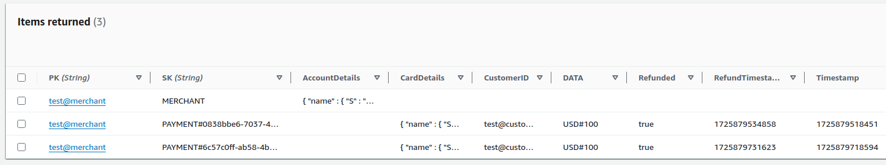

# Payment Platform

This project was initiated using [Autostrada](https://autostrada.dev/).

With the rapid expansion of e-commerce, there is a pressing need for an efficient payment gateway. This project aims to
develop an online payment platform, which will be an API-based application enabling e-commerce businesses to securely
and seamlessly process transactions.

## Design

The platform's architecture adheres to Domain Driven Design principles, ensuring that the API interface and storage solution can be easily substituted without altering the core business logic. This design flexibility allows for the seamless integration of alternative entry points, such as gRPC, or the transition to SQL databases, requiring only the implementation of the necessary interfaces.

Simplified directory structure:

```bash
.
├── cmd
│   └── api           # REST API entry point for the application
├── infra
│   └── terraform     # IaC for the project
├── internal
│   ├── domain
│   │   ├── entities  # business entities
│   │   ├── service   # business logic
│   ├── storage       # storage layer
```

### Storage

AWS DynamoDB was selected as the storage solution due to API's known access pattern requirements, cost-effectiveness, scalability, and ease of maintenance. A simplified single-table design for DynamoDB was implemented to demonstrate the potential for expanding access patterns as the platform evolves.



[Further read about a single-table design](https://www.alexdebrie.com/posts/dynamodb-single-table/)

## Assumptions

### Storage

The project assumes that data access patterns are known and extensive analytics on platform data are not required. If these assumptions prove incorrect, a traditional SQL database like PostgreSQL would be a more suitable choice.

### Bank simulator

A simplified bank simulator interface was created to demonstrate the integration of external services into the platform. In a real-world scenario, a bank API would likely require more complex communication.

### Data models

Simplified data models were developed to illustrate the data flow and basic functionalities of the platform. In a production API, these models would require additional fields and more robust validation.

### Security

Authentication and authorization mechanisms have been simplified to demonstrate their integration into the platform. In a production environment, tokens would be obtained from and validated by an Identity Provider.


## Running the application

To modify default settings, export the desired environment variables before running the application. Available configuration options can be found in the `cmd/api/main.go` file. Please note that some automations may cease to function when altering these settings.

### Prerequisites

- Go 1.23
- AWS credentials with sufficient permissions to create and interact with a DynamoDB table
- (Optional) Terraform to create the DynamoDB table

### Initial setup

The platform includes a setup functionality to facilitate initial testing. This setup creates a DynamoDB table and populates it with initial data required for running requests. The table is automatically removed when the platform is stopped.

To utilize the setup functionality export the `SETUP=true` environment variable before running the application.

The code for the setup is in the `internal/setup` package.

#### Alternative setup with Terraform

If you prefer to use Terraform to create the DynamoDB table, you can do so by running the following commands, but please mind that the tests data will have to be added manually:

```bash
cd infra/terraform
terraform init
terraform apply
```

Do not forget to destroy the resources with `terraform destroy` after you are done with testing.

### Running the application

Make sure you have the AWS credentials set up in your shell environment. The default region was set to `us-east-1`.
Also make sure that all dependencies are fetched with `go mod tidy`.

```bash
SETUP=true make run  # start the application with setup

make run  # start the application without setup
```


## Testing the application

### Postman

To test the platform API you can use the provided Postman collection and environment from the `/postman` directory.
They contain default values that are also aligned with the defaults set in the `cmd/api/main.go` file.
The collection is automated which means that the `authToken` and `paymentID` variables are automatically read from the incoming requests.

To test the platform run calls:

- `GET /status` to check if the platform is running
- `GET /token` to obtain and save the authentication token as `authToken`
- `POST /payments` to request creation of a new payment and save the returned `paymentID`
- `GET /payments/:paymentID` to retrieve payment details
- `PATCH /payments/:paymentID/refund` to request a refund for the specific payment
- `GET /payments/:paymentID` to retrieve updated payment details and verify that the refund was processed successfully


### Automated tests

To run unit tests and generate a coverage report execute the following commands:

```bash
make audit  # run tests and quality checks
make test  # run tests
make test/cover  # run tests and display coverage report in the browser
```

## Improvements

### Error handling

Error handling could be enhanced by implementing custom errors and managing them within the service domain layer. Currently, errors leak implementation details outside the API, which is a security concern. The service domain layer should only return errors safe for user consumption.

### Test suite

Current tests cover only happy paths and are not comprehensive. Adding more edge cases and integration tests is necessary before production deployment.

### Security

Some data is stored and transmitted as plain text, which is insecure. Implementing encryption for sensitive information is crucial before production deployment.

### Retry mechanisms

The API currently lacks retry mechanisms when calling external services. Implementing these would be beneficial for handling request failures. Considerations should include request idempotency and proper failure handling of the entire request chain when one request fails. The platform currently lacks a transactional revert mechanism for requests that succeed when others fail.

### Docstrings

Adding docstrings to all functions and methods would benefit future developers in understanding the codebase.

### Validation

Additional validations could be added to the data models and API requests.

### Logging

Logging is very basic and could be improved by adding more context to the logs.

## Audit Trail

To implement an audit trail feature for the payment platform we could update the DynamoDB item for the PAYMENT with a new attribute to store trails. This approach would allow us to log all operations performed on the payment and track access frequency.
